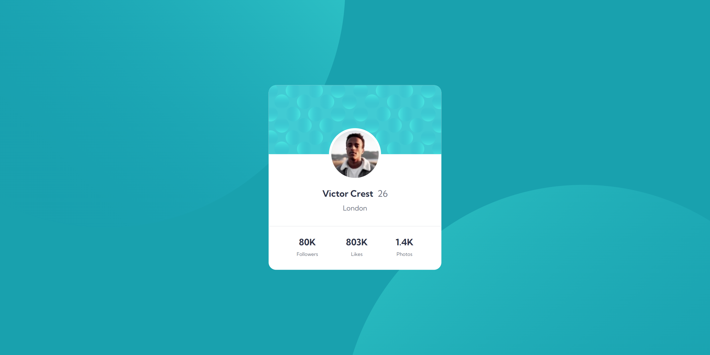

# Frontend Mentor - Profile card component solution

This is a solution to the [Profile card component challenge on Frontend Mentor](https://www.frontendmentor.io/challenges/profile-card-component-cfArpWshJ). 

## Table of contents

- [Overview](#overview)
  - [Screenshot](#screenshot)
  - [Links](#links)
- [My process](#my-process)
  - [Built with](#built-with)
  - [What I learned](#what-i-learned)
  - [Continued development](#continued-development)
  - [Useful resources](#useful-resources)
- [Author](#author)
- [Acknowledgments](#acknowledgments)

## Overview

### Screenshot
Original Design:

My Solution:

### Links

- Live Site URL: [Profile Card Component](https://ivaberiashvili.github.io/profile-card-component/)

## My process

My process improved with this project still. It took even less than my previous and less complex one.
I believe it came down to systematic approach that saved me lots of time.
Background property definitely took the most time to understand and implement, but overall I'm quite happy with the result/time spent ratio.

### Built with

- Semantic HTML5 markup
- CSS custom properties
- Flexbox

### What I learned

- I dug deeper into **background** property in general and realized I could add multiple images and position them separately in one property.

### Continued development

My [next project](https://github.com/ivaberiashvili/skilled-elearning-landing-page) is more complex fully responsive landing page.

### Useful resources

- [Mdn Web Docs > CSS > Background ](https://developer.mozilla.org/en-US/docs/Web/CSS/background) - This is extremely helpful resource with real time examples.
- [Simple Styles for <hr's](https://css-tricks.com/examples/hrs/) - This was a very cool discovery which I haven't used yet, but now I can use line in so many different ways.

## Author

- [Iva](https://github.com/ivaberiashvili)

